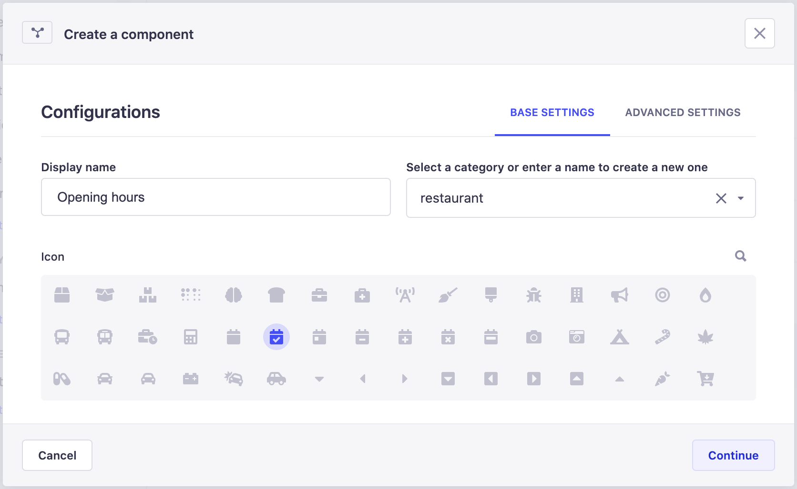

# Creating content-types

::: callout The Content-Type Builder is only accessible to create and update content-types when your Strapi application is in a development environment, else it will be in a read-only mode in other environments.
 
:::

The Content-Type Builder allows to create new content-types: single and collection types. Although they are not proper content-types as they cannot exist independently, components can also be created through the Content-Type Builder, in the same way as collection and single types.

## Creating a new content-type

Content types are created from the Content-Type Builder's Collection types and Single types categories, both displayed in the Content-Type Builder subnavigation.

To create a new content-type:

1. Choose whether you want to create a collection type or a single type.
2. In the category of the content-type you want to create, click on **Create a new collection/single type**.
3. In the content-type creation window, write the name of the new content-type in the *Display name* textbox.
4. Check the *API UID* to make sure the automatically pre-filled values are correct. Collection type names are indeed automatically pluralised when displayed in the Content Manager. It is recommended to opt for singular names, but the *API UID* field allows to fix any pluralisation mistake.
5. (optional) In the Advanced Settings tab, configure the available settings for the new content-type:

| Setting name    | Instructions                                                                                                                                     |
|-----------------|--------------------------------------------------------------------------------------------------------------------------------------------------|
| Draft & Publish | Click on **ON** to activate the Draft & Publish feature for your content-type (see [Saving & publishing content](/user-docs/latest/content-manager/saving-and-publishing-content.md#saving-publishing-content)). Click on **OFF** to deactivate the feature. |
| Enable localization for this Content-Type | (if the [Internationalization plugin](/user-docs/latest/plugins/strapi-plugins.md#internationalization-plugin) is installed) Tick the box to allow the content-type to be managed in various locales. |

6. Click on the **Continue** button.
7. Add and configure chosen fields for your content-type (see [Configuring fields for content-types](/user-docs/latest/content-types-builder/configuring-fields-content-type.md)).
8. Click on the **Save** button.

::: caution
New content-types are only considered created once they have been saved. Saving is only possible if at least one field has been added and properly configured. If these steps have not been done, a content-type cannot be created, listed in its category in the Content-Type Builder, and cannot be used in the Content Manager.
:::

## Creating a new component

Components are created from the same-named category of the Content-Type Builder's subnavigation.

To create a new component:

1. In the Components category of the Content-Type Builder subnavigation, click on **Create a new component**.
2. In the component creation window, configure the base settings of the new component:
   - Write the name of the component in the *Name* textbox.
   - Select an available category, or enter in the textbox a new category name to create one.
   - Choose an icon to represent the new component.
3. Click on the **Continue** button.
4. Add and configure chosen fields for your component (see [Configuring fields for content-types](/user-docs/latest/content-types-builder/configuring-fields-content-type.md)).
5. Click on the **Save** button.
